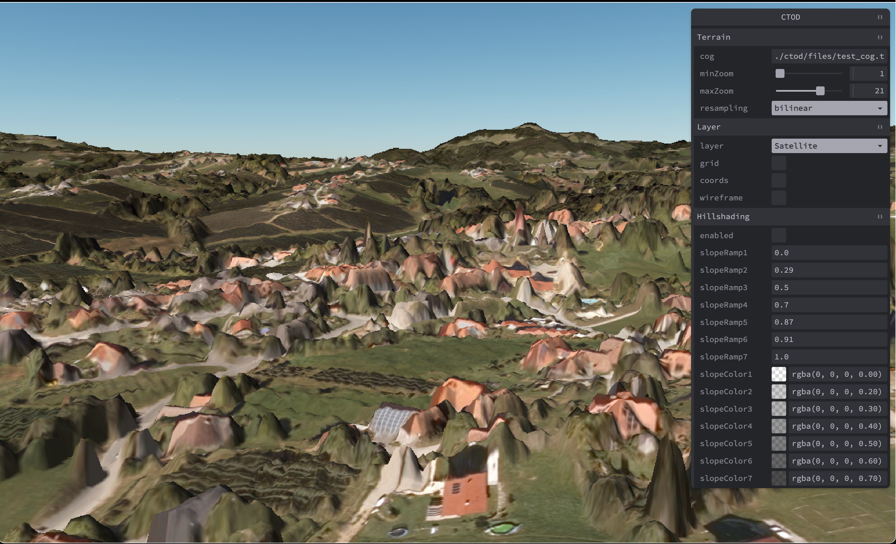

MacOS install Notes, Sonoma 14.2.1, Macbook M1, Python 3.11.6 via brew

I tried the https://github.com/sogelink-research/ctod?tab=readme-ov-file#run-ctod-from-source variant

The `poetry install` step failed for `triangle`, which I built from source (see https://rufat.be/triangle/installing.html)

`````
 git clone https://github.com/drufat/triangle.git
 git submodule update --init --recursive
 python setup.py install
`````

For testing I used a 1m digital surface map tile from SE Austria, which is available as COG GeoTIFF at https://data.bev.gv.at/download/ALS/DSM/20220915/ALS_DSM_CRS3035RES50000mN2650000E4750000.tif (ca 10GB; see [here](https://data.bev.gv.at/geonetwork/srv/ger/catalog.search;jsessionid=1F5F6A9D0278E6871FEDB6B87EE0936B#/metadata/1c8325ba-c226-4753-828e-1bcff26cc8f1)  for the metadata)

Result: Puch bei Weiz, Austria

